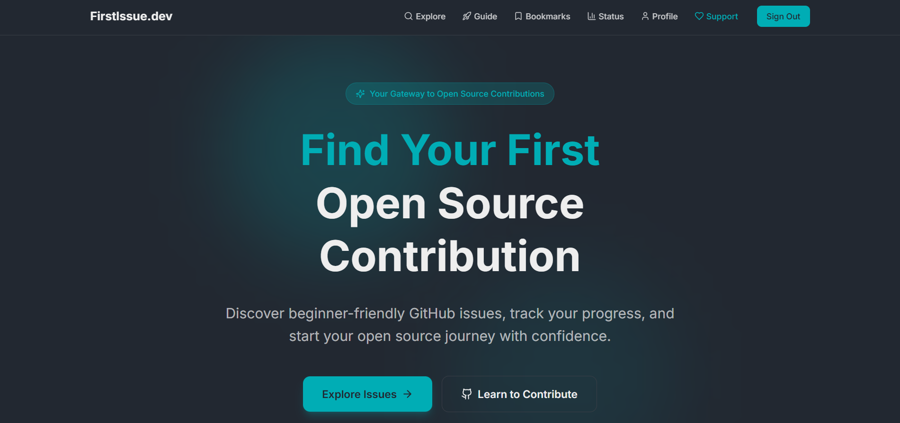
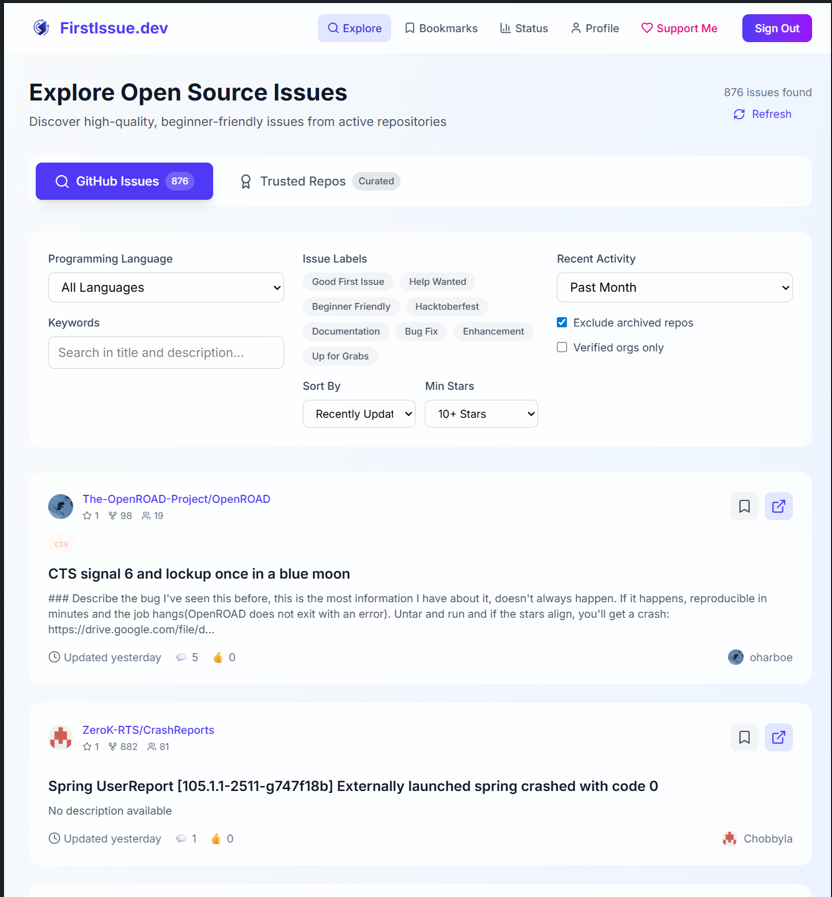
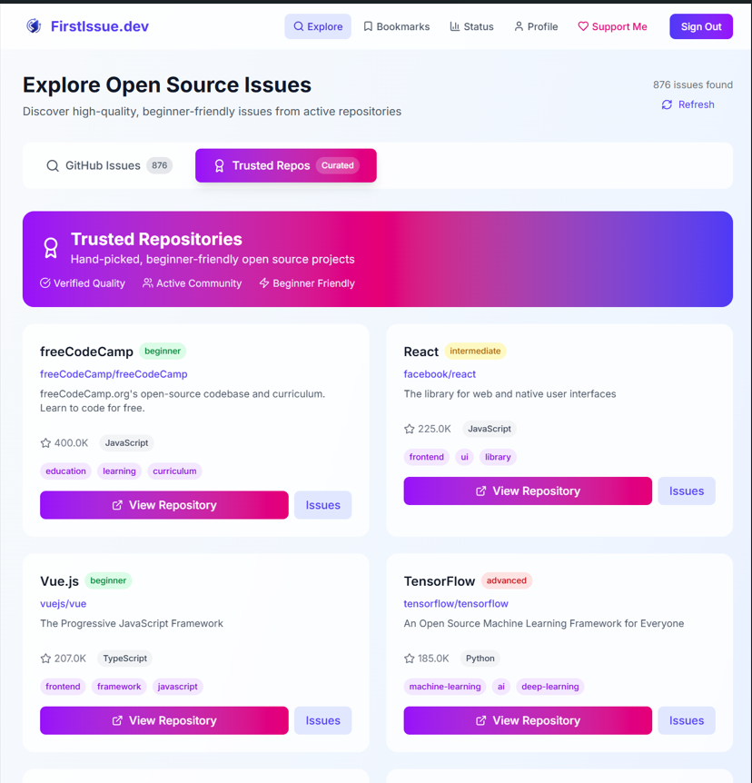
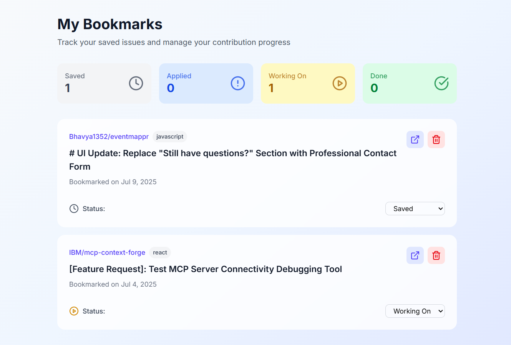
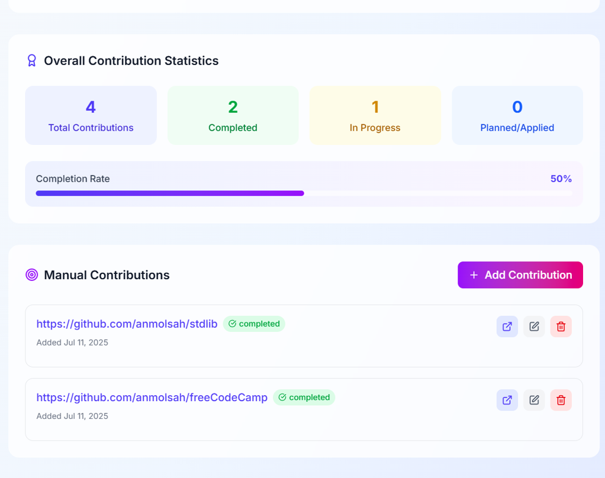

# FirstIssue.dev


**FirstIssue.dev** helps beginner developers find and track beginner-friendly GitHub issues — all in one clean, simple app.

Whether you're new to open source or looking for your next contribution, this platform helps you:

Discover curated beginner issues  
Bookmark and manage what you're working on  
Track your contribution journey

---

## Features

- **Search beginner-friendly issues**  
  Find issues labeled with `good first issue`, `help wanted`, and more from GitHub's public repositories.

- **Bookmark issues** for later  
  Save issues you're interested in and access them anytime from your dashboard.

- **Update contribution status**  
  Mark issues as `applied`, `working on`, or `done` to track your progress.

- **Add manual contributions**  
  Contributed outside FirstIssue.dev? No problem. Manually add repositories you've contributed to and manage their status.

- **Track your contribution progress**  
  Visualize your progress with personalized stats and history.

- **Secure login with Supabase**  
  Keep your bookmarks and activity private and synced across devices.

- **Clean and modern UI**  
  Fully responsive design built with React and Tailwind CSS for a seamless experience across all devices.

---

---

<!-- ## Preview

Here’s a quick look at the FirstIssue.dev platform:

### Homepage


### Explore Page


### Trusted Repos


### Bookmarks


### Profile
 -->
---

## Tech Stack

- **React.js + Vite**
- **Tailwind CSS**
- **Supabase** (Auth + Database)
- **GitHub REST API**
- **Lucide React Icons**

---

## Try It Locally

```bash
# Clone this repo
git clone https://github.com/anmolsah/firstissue.dev.git

## Go inside the folder
## cd firstissue.dev

# Install dependencies
npm install

# Start the dev server
npm run dev
```

Set your `.env` file with Supabase keys (see `.env.example`).

---

## Want to Contribute?

We’d love your help!  
Check out the [CONTRIBUTING.md](./docs/CONTRIBUTING.md) guide to get started.

---

Made with 💙 by [Anmol](https://github.com/anmolsah)

### Quick Start for Contributors

1. Fork this repository
2. Clone your fork
3. Set up the development environment
4. Find an issue to work on
5. Submit a pull request

### Find an Issue

-  [First-timers only](https://github.com/anmolsah/firstissue.dev/labels/first-timers-only) - Perfect for your first contribution
-  [Good first issue](https://github.com/anmolsah/firstissue.dev/labels/good%20first%20issue) - Beginner-friendly issues
-  [Help wanted](https://github.com/anmolsah/firstissue.dev/labels/help%20wanted) - We need your help!

### Contributors

Thanks to all our amazing contributors! See [CONTRIBUTORS.md](CONTRIBUTORS.md)

---

## Documentation

- [Contributing Guide](CONTRIBUTING.md)
- [Interview Questions](docs/interview.md) - Great for learning!
- [Issues to Create](docs/ISSUES_TO_CREATE.md) - For maintainers

---

## License

This project is licensed under the MIT License.

---

Made with 💙 by [Anmol](https://github.com/anmolsah)
