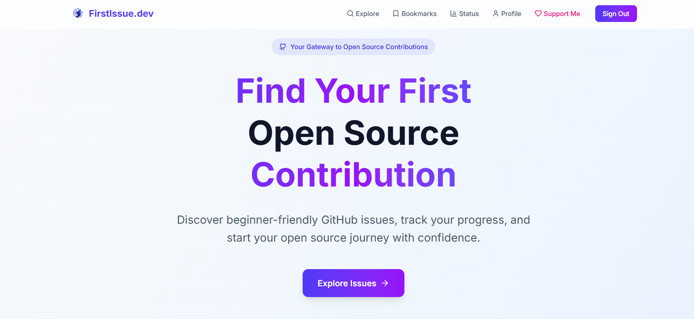

# 🚀 FirstIssue.dev


**FirstIssue.dev** helps beginner developers find and track beginner-friendly GitHub issues — all in one clean, simple app.

Whether you're new to open source or looking for your next contribution, this platform helps you:

✅ Discover curated beginner issues  
✅ Bookmark and manage what you're working on  
✅ Track your contribution journey

---

## ✨ Features

- 🔍 **Search beginner-friendly issues**  
  Find issues labeled with `good first issue`, `help wanted`, and more from GitHub's public repositories.

- 📌 **Bookmark issues** for later  
  Save issues you're interested in and access them anytime from your dashboard.

- 🔨 **Update contribution status**  
  Mark issues as `applied`, `working on`, or `done` to track your progress.

- 📝 **Add manual contributions**  
  Contributed outside FirstIssue.dev? No problem. Manually add repositories you've contributed to and manage their status.

- 📊 **Track your contribution progress**  
  Visualize your progress with personalized stats and history.

- 🔐 **Secure login with Supabase**  
  Keep your bookmarks and activity private and synced across devices.

- 🖼️ **Clean and modern UI**  
  Fully responsive design built with React and Tailwind CSS for a seamless experience across all devices.

---

---

<!-- ## 🖼️ Preview

Here’s a quick look at the FirstIssue.dev platform:

### 🏠 Homepage


### 🔍 Explore Page


### 📌 Trusted Repos


### 📌 Bookmarks


### 📌 Profile
 -->
---

## 🛠️ Tech Stack

- **React.js + Vite**
- **Tailwind CSS**
- **Supabase** (Auth + Database)
- **GitHub REST API**
- **Lucide React Icons**

---

## 🧪 Try It Locally

```bash
# Clone this repo
git clone https://github.com/anmolsah/firstissue.dev.git

## Go inside the folder
## cd firstissue.dev

# Install dependencies
npm install

# Start the dev server
npm run dev
```

Set your `.env` file with Supabase keys (see `.env.example`).

---

## 🙌 Want to Contribute?

We’d love your help!  
Check out the [docs/CONTRIBUTING.md](CONTRIBUTING.md) guide to get started.

---

Made with 💙 by [Anmol](https://github.com/anmolsah)

### Quick Start for Contributors

1. 🍴 Fork this repository
2. 📥 Clone your fork
3. 🔧 Set up the development environment
4. 🎯 Find an issue to work on
5. 🚀 Submit a pull request

### Find an Issue

- 🟢 [First-timers only](https://github.com/anmolsah/firstissue.dev/labels/first-timers-only) - Perfect for your first contribution
- 🟡 [Good first issue](https://github.com/anmolsah/firstissue.dev/labels/good%20first%20issue) - Beginner-friendly issues
- 🟠 [Help wanted](https://github.com/anmolsah/firstissue.dev/labels/help%20wanted) - We need your help!

### Contributors

Thanks to all our amazing contributors! See [CONTRIBUTORS.md](CONTRIBUTORS.md)

---

## 📚 Documentation

- [Contributing Guide](CONTRIBUTING.md)
- [Interview Questions](docs/interview.md) - Great for learning!
- [Issues to Create](docs/ISSUES_TO_CREATE.md) - For maintainers

---

## 📄 License

This project is licensed under the MIT License.

---

Made with 💙 by [Anmol](https://github.com/anmolsah)
