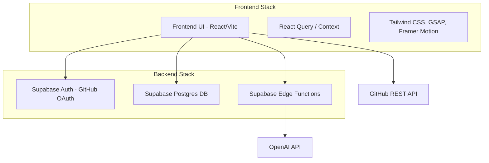

# FirstIssue.dev - Full System Design

## 1. Overview
FirstIssue.dev is a developer platform designed to help engineers start and track their open-source contribution journey. It simplifies finding beginner-friendly issues, tracks contribution progress directly through GitHub integration, and aggregates merged work into verified developer portfolios. The system heavily leverages AI to assist developers via an AI Copilot and "Contribution Kits."

## 2. System Architecture

The architecture is built on a modern serverless stack, optimizing for rapid iteration, secure data access, and high-performance client-side rendering.

### Core Technologies
*   **Frontend**: React 19, Vite, TailwindCSS (v4), React Router, GSAP/Framer Motion (Animations), React Query (Data Fetching/Caching).
*   **Backend**: Supabase (PostgreSQL), Supabase Auth, Row Level Security (RLS).
*   **AI/Functions**: Supabase Edge Functions, OpenAI API (for AI Copilot, embeddings, Contribution Kits).
*   **Deployment**: Vercel.

## 3. Frontend Architecture

The frontend is a Single Page Application (SPA) structured around a feature-first component hierarchy.

### 3.1. Structure
*   **Pages (`src/pages`)**: Route-level components. Examples: `ExplorePage`, `StatusPageNew`, `ProfilePageNew`, `AIPage`, `ContributionBookPage`.
*   **Components (`src/components`)**: Reusable UI blocks like `Navbar`, `AppSidebar`, `TimelineFeatures`, `MetalCard`, `BadgeModal`, `AICopilot`.
*   **Contexts & Hooks (`src/contexts`, `src/hooks`)**: Global state (e.g., authentication state, UI theme) and custom hooks (e.g., `useGitHubSync`).
*   **Services (`src/services`)**: API interaction layer isolating external calls.

### 3.2. State Management & Data Fetching
*   **Server State**: `@tanstack/react-query` is used to manage server state, caching, and background syncing.
*   **GitHub Sync**: Custom hooks handle synchronization of user contributions directly from the GitHub REST API to limit backend bottlenecks.

### 3.3. Styling & Animations
*   **Styling**: `tailwindcss` handles utility-first styling for responsive layouts.
*   **Animations**: `framer-motion` and `gsap` provide premium, dynamic micro-interactions (e.g., badge unlocks, portfolio reveals).

## 4. Backend Architecture & Database Schema

The backend relies entirely on Supabase, leveraging PostgreSQL's robustness combined with Row Level Security (RLS) for zero-trust security.

### 4.1. Key Database Entities
*   `auth.users`: Core user accounts (managed by Supabase Auth).
*   `profiles`: Extended user metadata, signup index, tech stack.
*   `contributions`: Tracks GitHub activity (issue numbers, PR URLs, merge status, comment counts).
*   `chat_sessions`: FirstMate AI chat history (JSONB payloads, user scoped).
*   `contribution_kits`: Cached AI-generated starter kits for issues.
*   `contribution_kit_usage` / `ai_copilot_daily_quota`: Atomic counters for tracking limits per user.
*   `attestations`: Verified claims or quantified impacts of user contributions.
*   `supporters`: Tracks premium "supporter" status which unlocks unlimited AI usage.
*   `kb_embeddings` & `ai_learned_solutions`: Vector storage for documentation/RAG contexts.

### 4.2. Security (Row Level Security)
Direct database queries from the frontend are secured using RLS policies.
Example: Users can only `SELECT`, `INSERT`, `UPDATE`, `DELETE` rows in `contributions` or `chat_sessions` where `auth.uid() = user_id`.

## 5. Key Systems and Workflows

### 5.1. GitHub Sync & Contribution Tracking
1.  **Auth**: Users authenticate via GitHub OAuth, granting FirstIssue access to read public repository data.
2.  **Sync**: `useGitHubSync` triggers parallel calls to GitHub's API to fetch assigned issues and authored PRs.
3.  **Link & Status Detection**: The client matches PRs to their respective issues, determines the current status (Draft, Open, Merged, Closed), and calculates activity (comments, assignment).
4.  **Upsert**: Processed data is upserted into the `contributions` table on Supabase.

### 5.2. AI Copilot & Contribution Kit
*   **Contribution Kit**: A one-click feature that generates a starter guide for an issue.
    *   **Workflow**: User clicks "Generate Kit" -> Edge Function is invoked -> Edge Function checks `contribution_kits` for a cached version. If none exists, it checks `consume_kit_quota`. If quota is available, it calls OpenAI to generate the kit, saves it to the DB, and returns it to the client.
    *   **Quota**: Free users have a monthly limit tracked via a PL/pgSQL function (`consume_kit_quota`) with row-level locking to prevent race conditions.
*   **AI Copilot**: A conversational interface for helping users debug code or understand issues. Uses RAG against `kb_embeddings` and `ai_learned_solutions`.

### 5.3. Live Portfolio & Badging System
*   **Portfolio (`ProfilePageNew`)**: Aggregates merged PRs and closed issues into a public-facing developer profile.
*   **Badges**: Users earn dynamic badges based on their activity (e.g., "First Merge", "10 Issues Fixed"). Badges are displayed using `BadgeCard` and `BadgeModal`, and can be shared externally.

### 5.4. Supporter System
*   Users can become "supporters" (premium tier).
*   Supporters bypass daily/monthly quotas for AI features, managed securely via the `supporters` table and edge functions.

## 6. Edge Functions & API Integration
To protect secrets (like OpenAI API keys), complex or privileged operations run in Supabase Edge Functions:
*   **AI Generation**: Calling OpenAI for Contribution Kits and Copilot responses.
*   **Quota Management**: Service-role execution of quota increments.
*   **Webhooks**: Handling payment events or GitHub webhooks.

## 7. Performance & Scalability Considerations
*   **Client-Side Rate Limiting**: GitHub API calls are throttled and cached locally (e.g., auto-sync only runs if > 5 minutes have passed since the last sync).
*   **Database Indexing**: Critical indexes exist on `user_id`, `created_at`, `updated_at`, and status fields across high-volume tables (`contributions`, `chat_sessions`).
*   **Atomic Transactions**: Quota usage increments use `FOR UPDATE` row locking to safely handle concurrent requests.
*   **Vector Search**: Embeddings (`kb_embeddings`) likely utilize `pgvector` for efficient similarity searches during RAG operations.
*   **CDN Delivery**: Vercel serves the static frontend assets and handles global edge routing.
